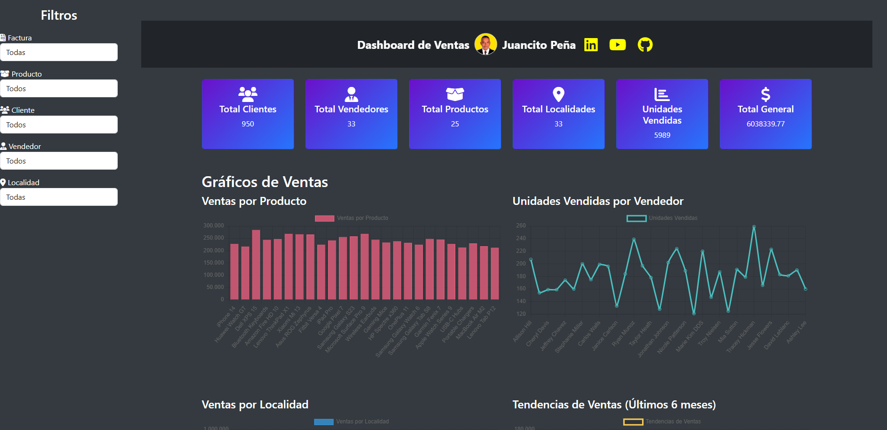
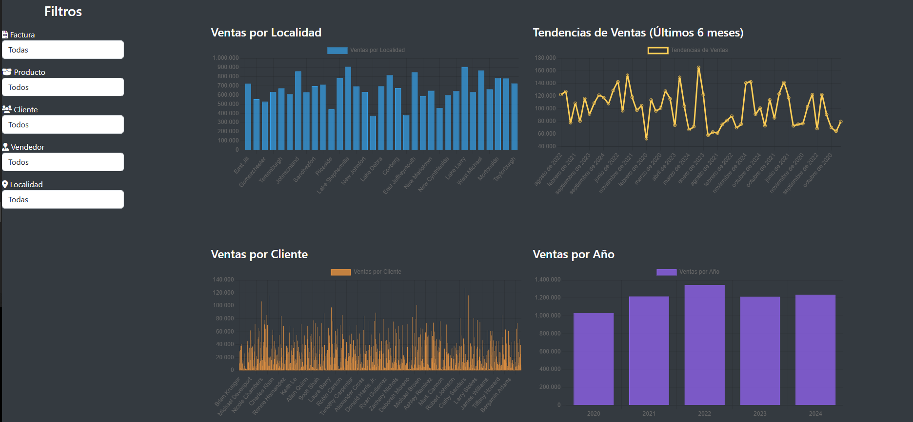

# 📊 Dashboard de Ventas: Proyecto Educativo y Profesional

## Índice

1. [Introducción](#introducción-)
2. [Repositorio de la Base de Datos JSON](#repositorio-)
3. [Gráficos y Visualizaciones](#-gráficos-y-visualizaciones)
4. [Filtros](#-filtros)
5. [Medidas y KPIs](#-medidas-y-kpis)
6. [Tecnologías Utilizadas](#️-tecnologías-utilizadas)
7. [Estructura del Proyecto](#-estructura-del-proyecto)
8. [Visión Educativa](#-visión-educativa)
9. [Beneficios Académicos](#-beneficios-académicos)
10. [Características Educativas](#-características-educativas)
11. [Casos de Estudio](#-casos-de-estudio)
12. [Ruta de Aprendizaje](#-ruta-de-aprendizaje)
13. [Tecnologías y Recursos](#-tecnologías-y-recursos)
14. [Contribución Académica](#-contribución-académica)
15. [Comunidad y Soporte](#-comunidad-y-soporte)
16. [Clonar el Repositorio](#-clonar-el-repositorio)
17. [Dar Feedback](#️-dar-feedback)
18. [Mejoras y Sugerencias](#️-mejoras-y-sugerencias)
19. [Compartir el Proyecto](#-compartir-el-proyecto)
20. [Dar Estrellitas](#-dar-estrellitas)
21. [Licencia y Uso Educativo](#-licencia-y-uso-educativo)
22. [Nota del Docente](#-nota-del-docente)

## Introducción 🌟

👋 ¡Hola a todos!

🎉 Bienvenidos a este repositorio en GitHub. En esta ocasión, les presento un proyecto que trata sobre el uso de tecnologías de programación web como HTML, CSS, Bootstrap, y JavaScript 🖥️, junto con la librería de gráficos dinámicos Chart.js 📊. Además, utiliza una base de datos en formato JSON con una estructura tipo factura que detalla información sobre clientes, vendedores, fechas, localidades, entre otros datos relevantes.

## Repositorio 📂

El Repositorio de la Base de Datos JSON lo puedes encontrar [aquí](https://raw.githubusercontent.com/JUANCITOPENA/RECURSOS-DE-BASE-DE-DATOS-Y-DATOS-CURSOS-SQL-SERVER-Y-ANALISIS-DE-DATOS/refs/heads/main/ventas_tecnologia.json) 🔗

✨ Este proyecto tiene como objetivo mostrar cómo, incluso con tecnologías web básicas, podemos crear un dashboard de ventas que incluye algunos resúmenes KPI, análisis dinámico, y gráficos interactivos que cambian según los filtros aplicados. También destaca la importancia del diseño UI/UX 🎨, así como el uso de contrastes adaptados a la marca y las necesidades del proyecto.

📚 Está diseñado como una herramienta de aprendizaje tanto para programadores principiantes como para aquellos con experiencia que deseen profundizar en el desarrollo web. También es útil para entusiastas y analistas de datos 📈 que buscan explorar alternativas a herramientas más comunes como Excel, SQL, Power BI, Python, R, Tableau, entre otras.

💡 Espero que encuentren este proyecto interesante y que les sirva como guía para aprender y experimentar con tecnologías web.
Este dashboard no es solo una herramienta de visualización; es un proyecto completo que:
- Integra tecnologías web modernas como HTML5, CSS3, JavaScript, Chart.js y Bootstrap
- Transforma datos complejos de ventas en visualizaciones interactivas y comprensibles
- Ofrece una experiencia práctica con datos y escenarios del mundo real
- Proporciona una base sólida para el aprendizaje y desarrollo profesional

## 📊 Gráficos y Visualizaciones

- ✅ **🛒 Ventas por Producto**: Este gráfico muestra las ventas totales por producto, permitiendo a los usuarios identificar cuáles productos están generando más ingresos.
- ✅ **📊 Unidades Vendidas por Vendedor**: Este gráfico presenta las unidades vendidas por cada vendedor, ayudando a evaluar el rendimiento individual de los vendedores.
- ✅ **📍 Ventas por Localidad**: Este gráfico muestra las ventas totales por localidad, proporcionando una visión geográfica del rendimiento de las ventas.
- ✅ **📈 Tendencias de Ventas (Últimos 6 meses)**: Este gráfico de línea muestra las tendencias de ventas durante los últimos seis meses.
- ✅ **👤 Ventas por Cliente**: Este gráfico muestra las ventas totales por cliente, ayudando a identificar a los clientes más valiosos.
- ✅ **📆 Ventas por Año**: Este gráfico muestra las ventas totales por año, proporcionando una visión a largo plazo del rendimiento de las ventas.
- ✅ **📊 Media de Ventas por Mes**: Este gráfico muestra la media de ventas por mes.
- ✅ **📊 Mediana de Ventas por Mes**: Este gráfico muestra la mediana de ventas por mes.
- ✅ **📊 Moda de Ventas por Mes**: Este gráfico muestra la moda de ventas por mes.
- ✅ **📊 Desviación Estándar de Ventas por Mes**: Este gráfico muestra la desviación estándar de ventas por mes.
- ✅ **🛒 Diagrama de Pareto por Producto**: Este gráfico de Pareto muestra la distribución de ventas por producto.
- ✅ **👤 Diagrama de Pareto por Cliente**: Este gráfico de Pareto muestra la distribución de ventas por cliente.
- ✅ **📊 Diagrama de Pareto por Vendedor**: Este gráfico de Pareto muestra la distribución de ventas por vendedor.
- ✅ **📍 Diagrama de Pareto por Localidad**: Este gráfico de Pareto muestra la distribución de ventas por localidad.

## 🔍 Filtros

- ✅ **Filtro por Factura**: Permite filtrar los datos por número de factura.
- ✅ **Filtro por Producto**: Permite filtrar los datos por producto.
- ✅ **Filtro por Cliente**: Permite filtrar los datos por cliente.
- ✅ **Filtro por Vendedor**: Permite filtrar los datos por vendedor.
- ✅ **Filtro por Localidad**: Permite filtrar los datos por localidad.

## 📈 Medidas y KPIs

- ✅ **Total de Clientes**: Número total de clientes únicos.
- ✅ **Total de Vendedores**: Número total de vendedores únicos.
- ✅ **Total de Productos**: Número total de productos únicos.
- ✅ **Total de Localidades**: Número total de localidades únicas.
- ✅ **Unidades Vendidas Totales**: Número total de unidades vendidas.
- ✅ **Total General de Ventas**: Total general de ventas.
- ✅ **Margen Total**: Margen total calculado.
- ✅ **Porcentaje de Margen Total**: Porcentaje de margen total.
- ✅ **Ventas por Año (2020-2024)**: Ventas totales por año.

## 🛠️ Tecnologías Utilizadas

- **HTML5**: Estructura básica de la página web
- **CSS3**: Estilos y diseño de la interfaz de usuario
- **Bootstrap**: Framework CSS para diseño responsivo
- **JavaScript**: Lógica de programación y manipulación del DOM
- **Chart.js**: Librería para crear gráficos dinámicos e interactivos
- **jQuery**: Librería JavaScript para manipulación del DOM y solicitudes AJAX

## 📂 Estructura del Proyecto

- **index.html**: Archivo principal que contiene la estructura HTML del dashboard
- **styles.css**: Archivo CSS que contiene los estilos y diseño
- **script.js**: Archivo JavaScript que contiene la lógica de programación
- **data.json**: Archivo JSON que contiene los datos de ventas





🌐 Prueba el proyecto aquí:

👉 [Dashboard de Ventas](https://juancitopena.github.io/DASHBOARD_VENTAS_JS/)

## 🎓 Visión Educativa

Este proyecto nace de la necesidad de proporcionar una plataforma práctica y accesible para el aprendizaje de tecnologías modernas. Como herramienta educativa, el Dashboard de Ventas ofrece:

- **Aprendizaje Práctico**: Implementación real de conceptos teóricos
- **Desarrollo de Competencias**: Habilidades técnicas y analíticas
- **Solución Económica**: Alternativa accesible a software comercial costoso
- **Portfolio Profesional**: Proyecto demostrable para entrevistas laborales

## 💡 Beneficios Académicos

### Para Estudiantes
- Experiencia práctica con tecnologías del mundo real
- Comprensión de flujos de datos y visualización
- Desarrollo de pensamiento analítico
- Proyecto base para experimentación y mejoras

### Para Profesionales
- Actualización en tecnologías modernas
- Herramienta personalizable para análisis de datos
- Base para proyectos más complejos
- Oportunidad de mentoría y contribución

### Para Educadores
- Material didáctico práctico
- Ejemplo de implementación real
- Recurso para asignaciones y proyectos
- Plataforma para enseñar metodologías ágiles

## ✨ Características Educativas

- **Módulos Progresivos**: Aprende paso a paso, desde lo básico hasta lo avanzado
- **Documentación Didáctica**: Explicaciones detalladas y ejemplos prácticos
- **Casos de Uso**: Escenarios reales para práctica y análisis
- **Retos de Implementación**: Ejercicios para reforzar el aprendizaje

## 📊 Casos de Estudio

1. **Análisis Básico de Ventas**
   - Visualización de datos fundamentales
   - Filtros simples y agrupaciones
   - Interpretación de resultados

2. **Análisis Avanzado**
   - Predicciones y tendencias
   - Segmentación de clientes
   - Optimización de inventario

3. **Proyectos de Extensión**
   - Integración con APIs
   - Implementación de nuevas visualizaciones
   - Desarrollo de funcionalidades adicionales

## 📚 Ruta de Aprendizaje

### Nivel Principiante
1. HTML/CSS básico
2. JavaScript fundamentals
3. Conceptos básicos de datos

### Nivel Intermedio
1. Manipulación del DOM
2. Gráficos con Chart.js
3. Bootstrap y diseño responsivo

### Nivel Avanzado
1. Optimización y rendimiento
2. Integración con backends
3. Análisis avanzado de datos

## 💻 Tecnologías y Recursos

### Frontend
- HTML5 y CSS3 para estructura y estilo
- JavaScript para lógica e interactividad
- Chart.js para visualizaciones
- Bootstrap para diseño responsivo

### Herramientas Complementarias
- Git para control de versiones
- VS Code como IDE recomendado
- Chrome DevTools para debugging

## 🤝 Contribución Académica

¡Tu contribución es valiosa para la comunidad educativa!

1. **Documentación**: Mejora las explicaciones y ejemplos
2. **Código**: Implementa nuevas características o mejoras
3. **Tutoriales**: Comparte tu experiencia y conocimientos
4. **Reportes**: Identifica áreas de mejora

## 👥 Comunidad y Soporte

Únete a nuestra comunidad educativa:

- **LinkedIn**: [Juancito Peña](https://www.linkedin.com/in/juancitopeña/)
- **YouTube**: [Canal Educativo](https://www.youtube.com/channel/UCSob-3E5z4IHtMF5B4bN-FA)
- **GitHub**: [Repositorio](https://github.com/JUANCITOPENA)
- **Foro de Estudiantes**: [Próximamente]

## 📦 Clonar el Repositorio

Para clonar este repositorio, sigue estos pasos:

```bash
# Clonar el repositorio
git clone https://github.com/JUANCITOPENA/dashboard-de-ventas.git

# Acceder al directorio
cd dashboard-de-ventas

# Abrir en el navegador
open index.html
```

Contribución:

```bash
# Fork del repositorio
# Crear rama para feature
git checkout -b feature/NuevaCaracteristica

# Commit de cambios
git commit -m 'Añadir nueva característica'

# Push a la rama
git push origin feature/NuevaCaracteristica

# Crear Pull Request
```

## 🗣️ Dar Feedback

¡Nos encantaría recibir tu feedback! Si tienes sugerencias, comentarios o encuentras algún problema, por favor contáctanos a través de:

* **Issues en GitHub**: [Repositorio](https://github.com/JUANCITOPENA)
* **Correo Electrónico**: juancito.pena@gmail.com

## 🛠️ Mejoras y Sugerencias

Si tienes ideas para mejorar este proyecto, no dudes en compartirlas. Puedes:
* Abrir un issue en GitHub
* Enviarnos un correo electrónico con tus sugerencias

## 📢 Compartir el Proyecto

Si encuentras este proyecto útil, ¡compártelo con otros! Puedes hacerlo a través de:
* Redes sociales
* Foros de desarrollo
* Recomendándolo a amigos y colegas

## ⭐ Dar Estrellitas

Si te gusta este proyecto, no olvides darle una estrella en GitHub. ¡Tu apoyo nos motiva a seguir mejorando!

## 📜 Licencia y Uso Educativo

Este proyecto está bajo licencia MIT, permitiendo su uso libre en entornos educativos y comerciales. Agradecemos la atribución al usar este material en contextos académicos.

## 💬 Nota del Docente

Como docente de tecnologías, siempre insto a mis estudiantes a realizar proyectos básicos y fundamentales que les ayuden a resolver y solucionar problemas. Estos proyectos no solo son interesantes, sino que también resultan ser soluciones más baratas y efectivas para potenciar su aprendizaje y crecimiento. Este proyecto de Dashboard de Ventas es un excelente ejemplo de cómo se pueden aplicar tecnologías web modernas para crear herramientas poderosas y visualmente atractivas. ¡Anímate a contribuir y a aprender!

> "La educación es la llave maestra que abre las puertas del conocimiento y la innovación. Este proyecto es mi contribución para que estudiantes y profesionales desarrollen habilidades prácticas en un entorno real." - Juancito Peña, Educador en Tecnología

> "La educación es la herramienta más poderosa para transformar el mundo." – Nelson Mandela

¡Gracias por ser parte de esta iniciativa educativa! Juntos podemos crear un impacto positivo en la educación tecnológica. 🚀📚
